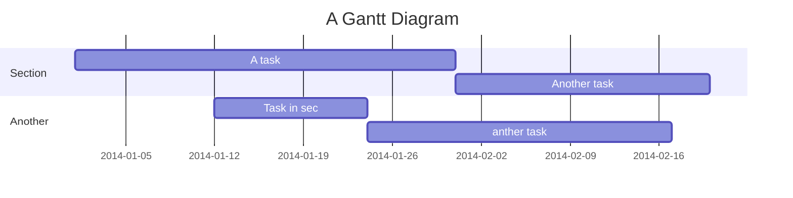
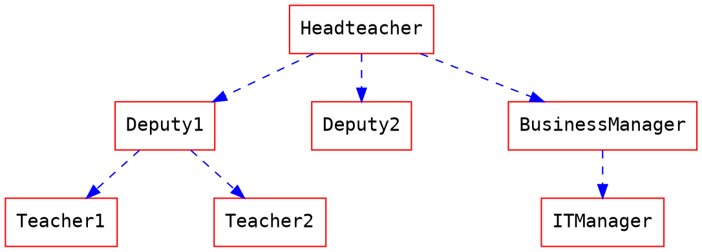

# 專案管理

## 甘特圖
### Mermaid

```mermaid
gantt
    title A Gantt Diagram

    section Section
    A task           :a1, 2014-01-01, 30d
    Another task     :after a1  , 20d
    section Another
    Task in sec      :2014-01-12  , 12d
    anther task      : 24d
```

## PERT/CPM圖

```graphviz
digraph hierarchy {

                nodesep=1.0 // increases the separation between nodes
                
                node [color=Red,fontname=Courier,shape=box] //All nodes will this shape and colour
                edge [color=Blue, style=dashed] //All the lines look like this

                Headteacher->{Deputy1 Deputy2 BusinessManager}
                Deputy1->{Teacher1 Teacher2}
                BusinessManager->ITManager
                {rank=same;ITManager Teacher1 Teacher2}  // Put them on the same level
}
```
## 關鍵路徑
