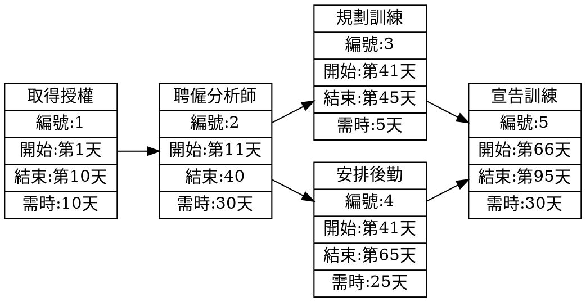

# 專案管理

## 甘特圖
### Mermaid


## PERT/CPM圖


## 關鍵路徑
### Mermaid
```mermaid
gantt
    C110118252任務清單
    section 任務
    研礙計劃           :a1, 2023-09-01, 1d
    任務分配           :a2, after a1  , 4d
    取得硬體           :a3, after a1  , 17d
    程式開發           :a4, after a2  , 70d
    安裝硬體           :a5, after a3  , 10d
    程式測試           :a6, after a4  , 30d
    撰寫使用手冊        :a7, after a5  , 25d
    轉換檔案           :a8, after a5  , 20d
    系統測試           :a9, after a6  , 25d
    使用者訓練         :a10, after a7  , 20d
    使用者測試         :a11, after a9  , 25d
```
